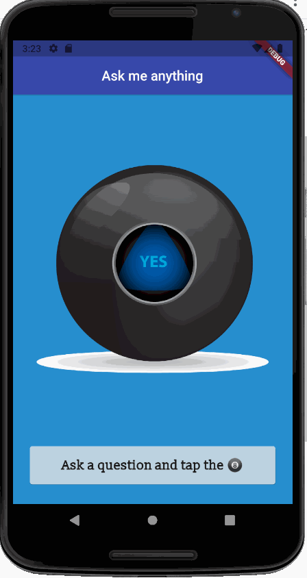

# Magic 8ball

This project was made during the App Brewery's Complete Flutter Development Bootcamp.

# I practiced and applied:

- Stateless and Stateful widgets
- Buttons and onPressed property
- Dart data types and variables, when and how to use them - var, String, int, double, bool, dynamic
- String interpolation
- Introduction to void functions
- The Expanded widget and flex layout features

- This is a simple app that randomly changes the image on the screen when tapped. A total of 5 available images with different 8ball answers so a user can receive random answers to random questions.

